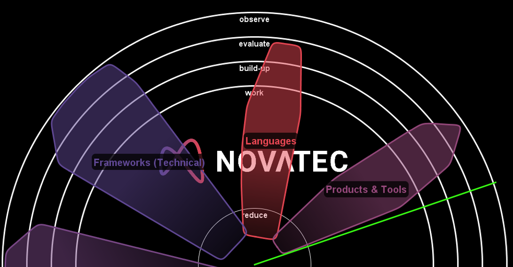

# techradar (Novatec Technology Radar)
## Introduction
The Novatec Technology Radar is a tool helping us to visualize our idea of topics/technologies
lifecycle. We strongly advise interested users to also look at the technology radar
tools and idea of Throughtworks: https://www.thoughtworks.com/de/radar.\
Also, keep in mind that the Novatec Technology Radar is a way to present your own view
on the lifecycle of a topic/technology. Someone else might have a completely different
view. It depends on your usage and your business case(s).
### Rings
Rings are used to show the status in the lifecycle of a particular topic. In general,
topics go through the following lifecycle: observe, evaluate, build-up, work, reduce.
However, some topics may not make it to evaluate (if they are not interesting for you).
After topics have been in reduce for some time, they are thrown out.

#### Observe
In this ring you put all the topics that could be interesting to look at.

#### Evaluate
This ring contains all topics that are being evaluated.

#### Build-Up
If topics are evaluated to be continued, they will appear in this ring.

#### Work
Those topics are relevant in our daily life.

#### Reduce
Those topics were important to us in the past. However, we still are working
with them -- but to be honest: we'd like to get rid of them.

### Categorization (Clusters)
Categories help human beings to think, to talk about stuff. This is why we love to categorize.
However, there might be different categories we may want to divide topics into:
* Strategic Topic
* Category
* Topic

Those categories above are part of this tool by default. The intention is:
* Strategic Topic: A coarse granular distinction, like Security, Architecture, ...
* Category: A more technical driven distinction - like frameworks, tools, languages, ...
* Topic: A fine granular distinction

Note that we call categories (Clusters) within the visualization.

## Usage
Start with `java -jar target/techradar-latest.jar <filename>`.\
If no filename is provided, a sample is loaded (part of the jar file).

### Basic features usage
__b__ : play animation : black whole (animated when pressed)\
__i__ : toggle visibility : show items\
__m__ : play animation : shrink cluster areas (animated when pressed)\
__p__ : toggle visibility : cluster areas\
__r__ : toggle animation : radar

### Advanced features usage
__space__ : redistribute items\
__c__: toggle animation : color change\
__f__ : toggle animation : follow mouse\
__Ctrl-F__ : enter search mode (then start typing...)\
__Esc__ : exit search mode\
__F12__ : toggle Fullscreen\
__j__ : toggle item display : simple/complex\
__k__ : switch to next cluster\
__K__ : switch to previous cluster\
__l__ : toggle visibility : cluster area lines\
__n__ : play animation : Novatec logo (animated when pressed)\
__o__ : toggle animation : sort items by cluster (slow)\
__O__ : toggle animation : sort items by cluster (fast)\
__s__ : capture and animate screen\
__t__ : toggle visibility : show item texts\
__x__ : toggle visibility : cluster area names\
__X__ : reset state\
__y__ : load file\
__z__ : switch square/circle\
__.__ : toggle animation : auto animation loop

## Format of the Input File
The input file must be a `tab separated` table in the following format:

<table align="left">
  <tr>
    <th>Deleted</td>
    <th>Dup</td>
    <th>Name</td>
    <th>Description</td>
    <th>Topic</td>
    <th>Ring</td>
    <th>Category</td>
    <th>Strategic Topic</td>
  </tr>
  <tr>
    <td>x</td>
    <td></td>
    <td>#BeyondBudgeting</td>
    <td>Alternative Agile Management</td>
    <td>Agility</td>
    <td>observe</td>
    <td>Methods & Organisationals</td>
    <td>Agile Methoden</td>
  </tr>
  <tr>
    <td></td>
    <td>x</td>
    <td>#Valuefirst</td>
    <td>Apply in daily work.</td>
    <td>Business Agility</td>
    <td>evaluate</td>
    <td>Methods & Organisationals</td>
    <td>Agile Methoden</td>
  </tr>
  <tr>
    <td></td>
    <td></td>
    <td>12-factor</td>
    <td>https://12factor.net, trying to follow the paradigm behind this</td>
    <td>Cloud Native Development</td>
    <td>work</td>
    <td>Concepts (Technical)</td>
    <td>Cloud</td>
  </tr>
</table>

If you need to make changes to the clusters, have a look at class `Cluster`.